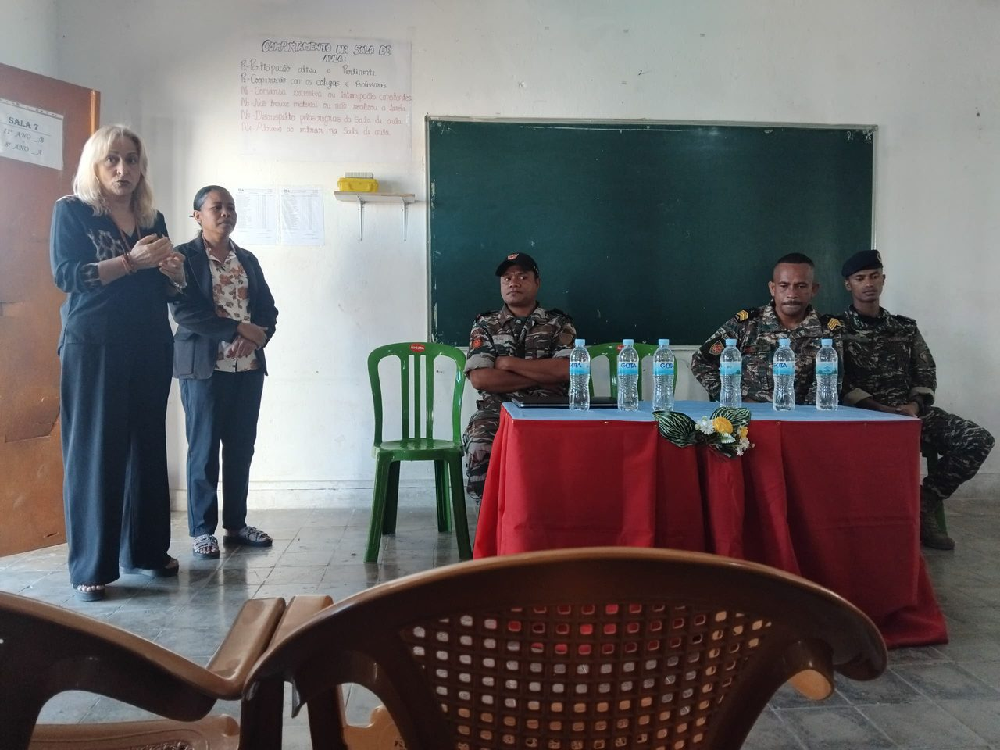

# PATCH — Notícia «Dia das FALINTIL» (20 de agosto de 2026)

Aplicar EXATAMENTE o mesmo em **cafe-liquica.html** e **index.html** (os dois ficheiros têm de ficar idênticos).

---

## Passo 1 — Retirar o destaque atual (é isto que muda a BARRA AMARELA)

A barra amarela do topo lê automaticamente o card que tiver `data-destaque="true"`.
Neste momento esse atributo está no card **«Formação sobre Saúde Reprodutiva no Ensino Secundário»** (categoria SAÚDE E CIDADANIA).

Procurar em cada ficheiro o **único** atributo `data-destaque="true"` existente — onde quer que ele esteja — e **apagar apenas esse atributo** (deixar o resto do card intacto).

Ou seja: `<div class="noticia-card" data-destaque="true" data-foto=...` passa a `<div class="noticia-card" data-foto=...`

---

## Passo 2 — Inserir o novo card como PRIMEIRO card

Localizar a linha:

```html
    <div class="noticias-grid">
```

e inserir **imediatamente a seguir** o bloco abaixo (fica antes de todos os outros `.noticia-card`):

```html
      <!-- Notícia 20 de agosto 2026 — Dia das FALINTIL (DESTAQUE) -->
      <!-- [REV-TT] traduções tétum (categoria, título, resumo) aguardam revisão -->
      <div class="noticia-card" data-destaque="true" data-foto="fotofalintil01.jpeg" data-galeria="fotofalintil01.jpeg|A abertura da sessão, com os militares das Forças Navais||fotofalintil02.jpeg|A sala do CAFE de Liquiçá durante a sessão||fotofalintil03.jpeg|A apresentação sobre a história das FALINTIL||fotofalintil04.jpeg|A bandeira das FALINTIL projetada, junto ao mapa-múndi||fotofalintil05.jpeg|Alunos e professores atentos à sessão||fotofalintil06.jpeg|Um aluno coloca uma questão aos militares||fotofalintil07.jpeg|A sala cheia de alunos do Ensino Secundário" data-cat="História e Cidadania" data-titulo="Dia das FALINTIL — alunos do Secundário conhecem a história da libertação nacional" data-texto="No dia 20 de agosto de 2026, data em que se comemora o Dia das FALINTIL, as Forças Navais destacadas no Município de Liquiçá realizaram, na Escola CAFE de Liquiçá, uma atividade de partilha da história e do papel das FALINTIL com os alunos do Ensino Secundário. A atividade teve como objetivo proporcionar aos alunos um maior conhecimento sobre a história da luta de libertação nacional, o contributo das FALINTIL e a importância da preservação da memória histórica de Timor-Leste. Ao longo da sessão, apoiada por uma apresentação projetada, os militares partilharam episódios da resistência e responderam às perguntas colocadas pelos alunos, que participaram ativamente. A iniciativa reuniu alunos, professores e a coordenação da escola, num encontro entre a memória de quem lutou pela independência e a geração que hoje estuda em liberdade. Ao CAFE de Liquiçá, esta é uma dimensão essencial do seu projeto educativo: conhecer a história do próprio país é parte de uma cidadania consciente." data-data="20 de agosto de 2026">
        
        <div class="noticia-corpo">
          <p class="noticia-cat" data-pt="História e Cidadania" data-tt="Istória no Sidadania">História e Cidadania</p>
          <h3 class="noticia-titulo" data-pt="Dia das FALINTIL — alunos do Secundário conhecem a história da libertação nacional" data-tt="Loron FALINTIL — estudante sekundáriu sira aprende istória libertasaun nasionál">Dia das FALINTIL — alunos do Secundário conhecem a história da libertação nacional</h3>
          <p class="noticia-resumo" data-pt="Por ocasião do Dia das FALINTIL, as Forças Navais destacadas no Município de Liquiçá vieram à escola partilhar com os alunos do Ensino Secundário a história e o papel das FALINTIL na luta de libertação nacional — e a importância de preservar a memória histórica de Timor-Leste." data-tt="Iha okaziaun Loron FALINTIL, Forsa Naval sira ne'ebé destaka iha Munisípiu Liquiçá mai eskola atu fahe ho estudante ensinu sekundáriu sira istória no papel FALINTIL nian iha luta libertasaun nasionál — no importánsia atu prezerva memória istórika Timor-Leste nian.">Por ocasião do Dia das FALINTIL, as Forças Navais destacadas no Município de Liquiçá vieram à escola partilhar com os alunos do Ensino Secundário a história e o papel das FALINTIL na luta de libertação nacional — e a importância de preservar a memória histórica de Timor-Leste.</p>
          <p class="noticia-data">20 de agosto de 2026</p>
          <div class="noticia-ctas">
            <span class="noticia-cta" data-pt="📖 Ler notícia completa →" data-tt="📖 Lee notísia kompletu →">📖 Ler notícia completa →</span>
            <span class="noticia-cta noticia-cta-galeria" data-pt="📸 Ver fotos" data-tt="📸 Haree foto sira">📸 Ver fotos</span>
          </div>
        </div>
      </div>
```

---

## Passo 3 — sitemap.xml (opcional)

Atualizar o `<lastmod>` do URL principal para `2026-08-20`.

---

## Verificação final

1. `grep -c 'data-destaque="true"' index.html` → tem de dar **1** (e tem de ser o card das FALINTIL)
1b. A barra amarela do topo passa a mostrar: HISTÓRIA E CIDADANIA · Dia das FALINTIL — alunos do Secundário conhecem a história da libertação nacional
2. `diff index.html cafe-liquica.html` → sem diferenças
3. As 7 fotos `fotofalintil01..07.jpeg` têm de estar na raiz do repositório
